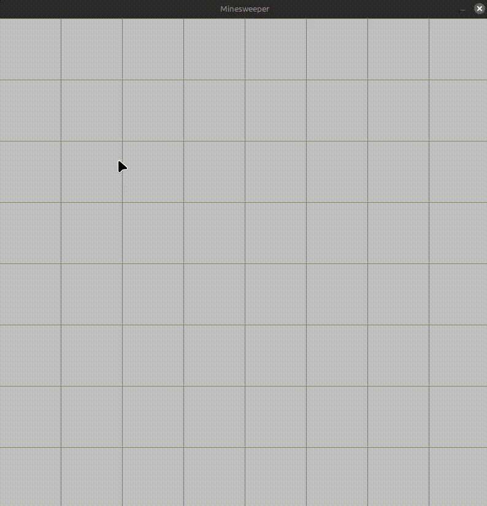

# C++ Minesweeper

This is a simple implementation of the classic Minesweeper game using the SDL2 library for graphics rendering. The game features grid-based gameplay, and random mine placement.

## Features
- Customizable Grid: Easily adjust grid size and spacing.
- Dynamic Rendering: Real-time updates with SDL2 rendering.
- Classic Minesweeper Logic: Neighbor detection, mine count visualization and recursively reveals neighbours. 

## Requirements

- SDL2 Library: Make sure SDL2 is installed on your system.
- C++ Compiler: A modern C++ compiler supporting C++11 or later.

## Customization

- Modify SCREEN_WIDTH and numOfSquares to adjust the window size and grid spacing.
- Update numOfMines to change the number of mines on the board.