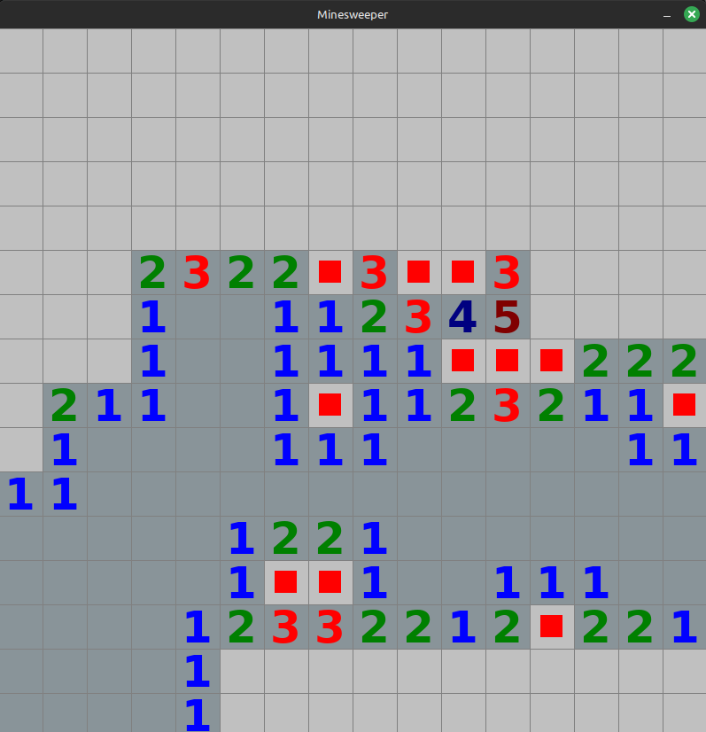

# C++ Minesweeper

This is a simple implementation of the classic Minesweeper game using the SDL2 library for graphics rendering. The game features grid-based gameplay, and random mine placement.

## Features
- Customizable Grid: Easily adjust grid size and spacing by changing the difficulty. 
- Dynamic Rendering: Real-time updates with SDL2 rendering. 
- Classic Minesweeper Logic: Neighbor detection, mine count visualization, flagging and recursively reveals neighbours. 
- Game loop: When you lose or win you can directly start a new game. 

## Requirements

- SDL2 Library: Make sure SDL2 is installed on your system.
- C++ Compiler: A modern C++ compiler supporting C++11 or later.

## How to play

- Left mouse button to reveal square.
- ESC to open difficulty menu.